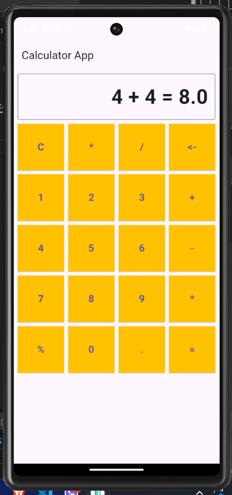
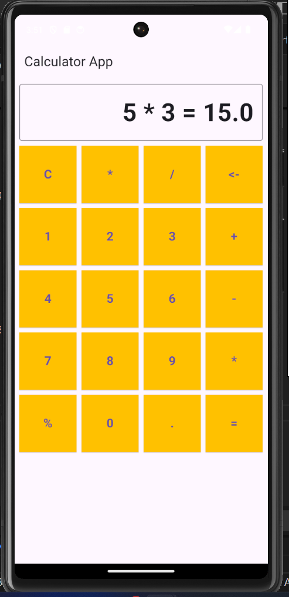
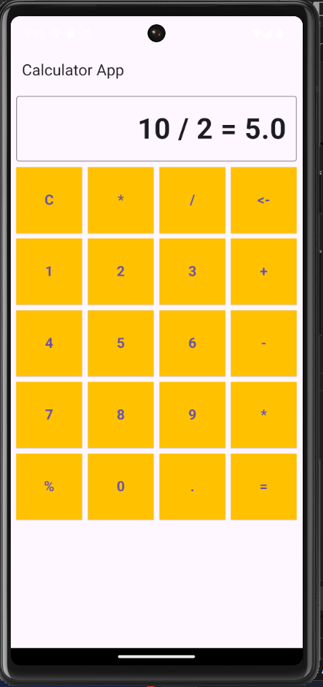
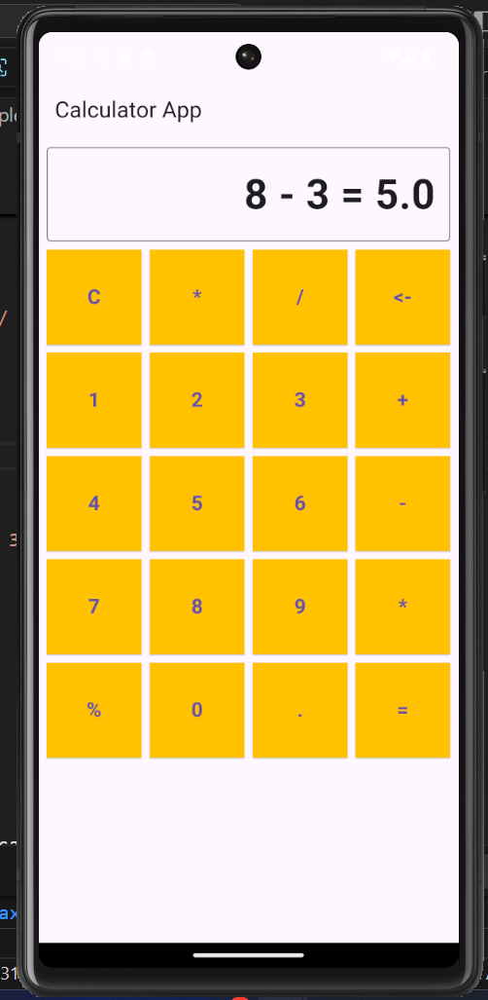

# Calculator App Project

## GitHub Repository Link
[GitHub Repository](https://github.com/SantoshKcy/Calculator_application.git)


## Output Example

### Example 1: 4 + 4
Here is a screenshot showing the output when you input `4 + 4`:



**Input**: `4 + 4`  
**Output**: `4 + 4 = 8`

### Example 2: 5 * 3
Here is a screenshot showing the output when you input `2 * 3`:



**Input**: `5 * 3`  
**Output**: `5 * 3 = 15`

### Example 3: 10 / 2
Here is a screenshot showing the output when you input `10 / 2`:



**Input**: `10 / 2`  
**Output**: `10 / 2 = 5`

### Example 4: 8 - 3
Here is a screenshot showing the output when you input `8 - 3`:



**Input**: `8 - 3`  
**Output**: `8 - 3 = 5`

## How to Run the Project
1. Clone the repository:

   ```bash
   git clone https://github.com/SantoshKcy/Calculator_application.git
